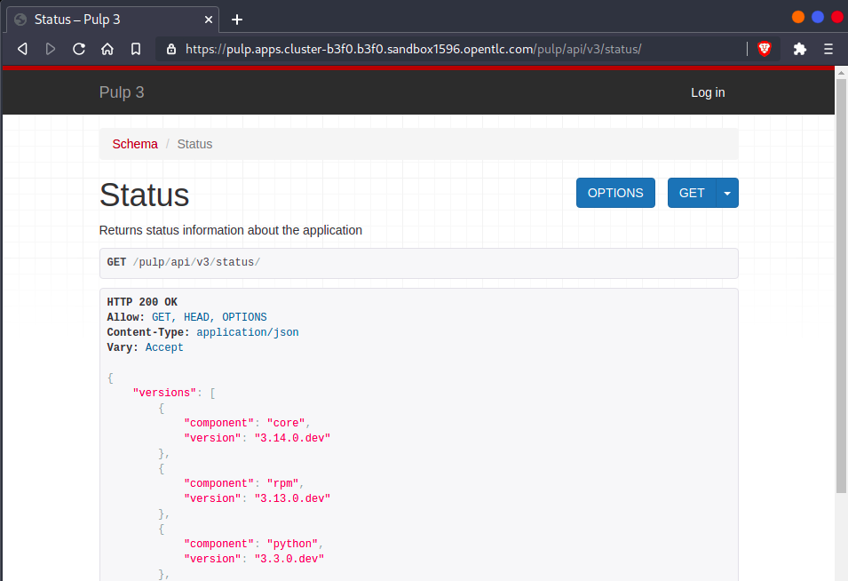

Getting started
===============

The Pulp 3 Ansible installer is a collection of roles to install or upgrade Pulp 3 hosted on galaxy:
[https://galaxy.ansible.com/pulp/pulp_installer](https://galaxy.ansible.com/pulp/pulp_installer)

Installation
------------
The recommended installation is from ansible-galaxy:

```bash
ansible-galaxy collection install pulp.pulp_installer
```

Using the example playbook
--------------------------

Some of the roles used in the playbook use root privileges on the managed node, so when prompted,
you will need to provide the password for the managed node user.

```bash
ansible-playbook playbooks/example-use/playbook.yml -u <managed_node_username> --ask-become-pass -i <managed_node_hostname>,
```

<script id="asciicast-335159" src="https://asciinema.org/a/335159.js" async data-autoplay="true" data-speed="2"></script>

To configure a custom installation, you will need to set [configuration variables](customizing.md). In the simplest case,
they can be set in the playbook. See the [Ansible docs](https://docs.ansible.com/ansible/latest/user_guide/playbooks_variables.html) for more flexible idiomatic alternatives.

After running the playbook, follow the [Post installation tasks](https://docs.pulpproject.org/pulp_installer/quickstart/#post-installation-tasks)
section to learn more about how to check the installation integrity.

The default Pulp admin user of the example playbook is `admin` and the default password is `password`.
To modify these values, please follow the steps from [Customizing Your Pulp Deployment](customizing.md).
!!! warning
		The example playbook installation is only for testing purposes and not meant to be used in production environment.

Example Playbook for Installing Plugins
---------------------------------------
As an example, we are going to write a playbook for installing `pulp_container` and `pulp_rpm`.

You can learn more about the variables on the [roles section](https://docs.pulpproject.org/pulp_installer/roles/pulp_common/#role-variables)

1.  Install the `pulp_installer` collection:
```bash
ansible-galaxy collection install pulp.pulp_installer
```

2.  Install the `geerlingguy.postgresql` role:
```bash
ansible-galaxy install geerlingguy.postgresql
```

3. Write the following playbook:
```bash
vim install.yml
```
```yaml
---
- hosts: all
  force_handlers: True
  vars:
    pulp_settings:
      secret_key: << YOUR SECRET HERE >>
      content_origin: "https://{{ ansible_fqdn }}"
    pulp_default_admin_password: << YOUR PASSWORD HERE >>
    pulp_install_plugins:
      # galaxy-ng:
      # pulp-2to3-migration:
      # pulp-ansible:
      # pulp-certguard:
      pulp-container:
      # pulp-cookbook:
      # pulp-deb:
      # pulp-file:
      # pulp-gem:
      # pulp-maven:
      # pulp-npm:
      # pulp-python:
      pulp-rpm:
  roles:
    - pulp.pulp_installer.pulp_all_services
  environment:
    DJANGO_SETTINGS_MODULE: pulpcore.app.settings
```

4. Run the playbook:
```bash
ansible-playbook install.yml -u <managed_node_username> --ask-become-pass -i <managed_node_hostname>,
```
<script id="asciicast-335829" src="https://asciinema.org/a/335829.js" async data-autoplay="true" data-speed="2"></script>

Further Customization
---------------------

This Getting Started guide is not exhaustive. See [Customizing Your Pulp Deployment](customizing.md)
for an explanation of the variables (`vars:`) you can put within the example playbook.

Also see [Object Storage](objectstorage.md) and [Let's Encrypt](letsencrypt.md) for setting up either of those 2 integrations.


Post installation tasks
-----------------------

After you have installed Pulp, install the [Pulp 3 CLI](https://github.com/pulp/pulp-cli/blob/develop/docs/quickstart.md).


#### Checking the installation

If the playbook execution went well, you can find a "*PLAY RECAP*" output, with the values `failed=0` and `unreachable=0` for the tasks on each of the hosts. For example:
```
PLAY RECAP ********************************************************************************************************************************************
pulp-host                       : ok=145  changed=1    unreachable=0    failed=0    skipped=93   rescued=0    ignored=0
```

An example of a **failed** installation would look something like:
```
TASK [geerlingguy.postgresql : Ensure PostgreSQL database is initialized.] ********************************************************************************************************************************************
fatal: [pulp-host]: FAILED! => {"changed": false, "module_stderr": "sudo: unknown user: postgres\nsudo: unable to initialize policy plugin\n", "module_stdout": "", "msg": "MODULE FAILURE\nSee stdout/stderr for the exact error", "rc": 1}

RUNNING HANDLER [geerlingguy.postgresql : restart postgresql] ********************************************************************************************************************************************
[WARNING]: Ignoring "sleep" as it is not used in "systemd"
changed: [pulp-host]

PLAY RECAP ********************************************************************************************************************************************
pulp-host             : ok=22   changed=5    unreachable=0    failed=1    skipped=27   rescued=0    ignored=0
```

in above example we can see:

 * on "*PLAY RECAP*" that a task failed for host **pulp-host**: `failed=1`
 * in which task it failed: `TASK [geerlingguy.postgresql : Ensure PostgreSQL database is initialized.`
 * and why: `fatal: [pulp-host]: FAILED! => {"changed": false, "module_stderr": "sudo: unknown user: postgres\nsudo: unable to initialize policy plugin\n", "module_stdout": "", "msg": "MODULE FAILURE\nSee stdout/stderr for the exact error", "rc": 1}`


#### Checking the installed packages

Depending on the environment, by default, if not defined in the playbook (or at a [custom location](https://docs.pulpproject.org/pulp_installer/customizing/#pulp-installers-types-of-variables))
the installer will deploy Pulp through a `virtual env` and using `pip`.

The recommended way to verify the Pulp packages and versions installed by `pulp_installer` is through the [/pulp/api/v3/status](https://docs.pulpproject.org/pulpcore/restapi.html#operation/status_read) endpoint which can be accessed through the web browser:


but it is also possible to check the packages from the host where pulp is running:

```bash
source /usr/local/lib/pulp/bin/activate
pip list | grep pulp
pip show pulp-{container,file,maven,python,rpm} pulpcore
```

